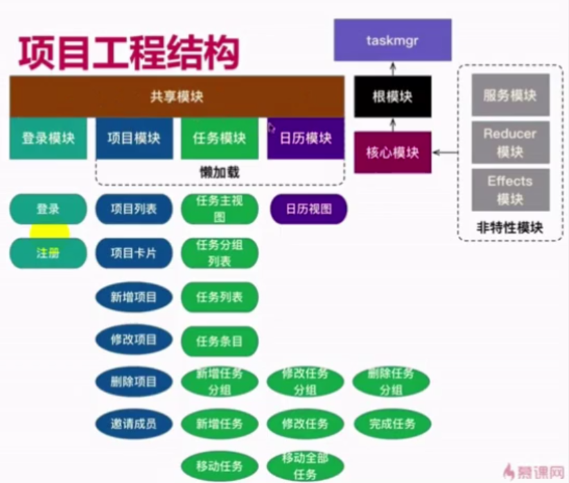
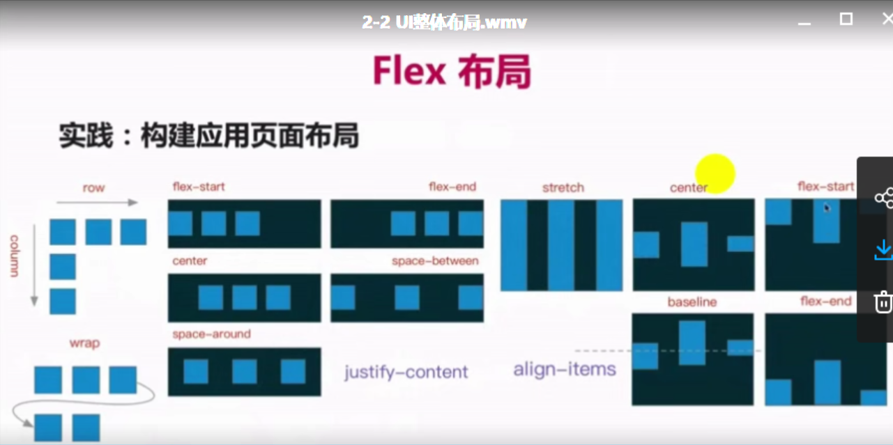
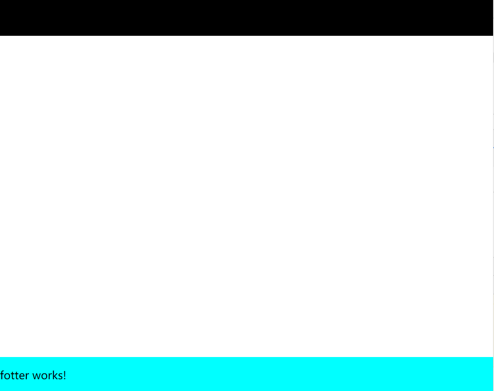
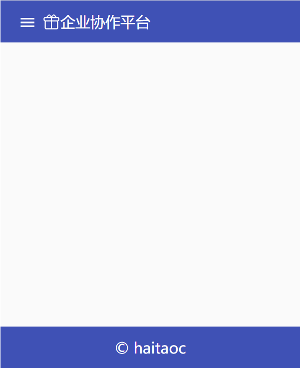
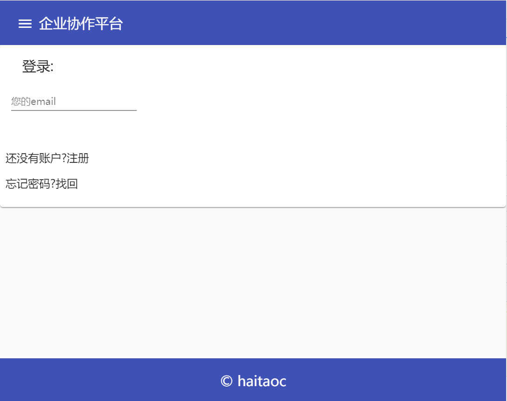

# Angular笔记

## cnpm 或yarn作为替代工具
```shell
npm i -g cnpm

cnpm i -g @angular/cli
```

## VSCode配置
```shell
插件：
debugger for chrome
angular 8 snippets - ...
Chrome 安装Augury插件
```
## 小命令
```shell
npm i --save 包名:软件依赖
npm i --save-dev 包名:开发依赖
ng new 项目名:新建项目
ng build -prod: 生产环境编译
ng server: 启动开发服务器
```
## 模拟数据
```shell
json-server:快速搭建REST API
# 安装
npm install -g json-server
# 使用
json-server <文件路径>
```



```shell
ng new taskmgr --skip-install --style=scss

cd .\taskmgr\
cnpm install
# 创建核心模块
ng g m core
# 创建共享模块
ng g m shared
# 创建组件
ng g c core/header --spec=false
ng g c core/fotter --spec=false
ng g c core/sidebar --spec=false
```
```javascript
@Optional()
@SkipSelf()
```


[flex布局参考网站](http://www.ruanyifeng.com/blog/2015/07/flex-grammar.html)
```html
<!-- app.component.html -->
<div>
  <header>
    <app-header></app-header>
  </header>
  <main>
    
  </main>
  <footer>
    <app-footer></app-footer>
  </footer>
</div>
```
```css
/* style.scss(作用于index.html--引入了app-root) */

html,body,app-root,.site{
    width:100%;
    height:100%;
    margin:0;
}

.site {
    display: flex;
    flex-direction: column; // 纵向按列排
}

main{
    flex:1;             // 用main撑满header和footer
}
```
效果


## Angular material
[官网](https://material.angular.io/guide/getting-started)
```javascript
cnpm install --save @angular/material @angular/cdk @angular/animations
```

```javascript
app.module.ts:

import { MatSidenavModule } from '@angular/material'
import { BrowserAnimationsModule } from '@angular/platform-browser/animations'

imports: [          
    BrowserModule,
    SharedModule,
    CoreModule,
    MatSidenavModule,   // 新加入
    BrowserAnimationsModule,// 新加入
    AppRoutingModule
  ],
```
```css
style.scss:
@import "~@angular/material/prebuilt-themes/indigo-pink.css";

mat-sidenav-container,html,body,app-root,.site{
    width:100%;
    height: 100%;
    margin:0;
}
```
```html
app.component.html:
<!-- 作为根容器 -->
<mat-sidenav-container>
    <!-- 侧边栏 #sidenav为模板引用变量,来引用mat-sidenav, mode属性默认为over,参考官网-->
    <mat-sidenav #sidenav mode="side">     
      <app-sidebar></app-sidebar>
    </mat-sidenav>
  <div class="site">
    <header>
      <app-header></app-header>
    </header>
    <main>
      <button (click)="sidenav.toggle()">打开侧边栏</button>
    </main>
    <footer>
      <app-footer></app-footer>
    </footer>
  </div>
</mat-sidenav-container>
```

```typescript
core.module.ts:

import { MatToolbarModule } from '@angular/material';

imports: [
    CommonModule,
    MatToolbarModule // 新加入
  ],
```
### Header:
```html
header.component.html:
<mat-toolbar color="primary">
    <!-- mat-icon-button 设置button是透明背景; <mat-icon>标签需要时button的子元素-->
    <button mat-icon-button (click)="openSidebar()">
        <mat-icon>menu</mat-icon>
    </button>
    <span>企业协作平台</span>
</mat-toolbar>


```
```typescript
header.component.ts:
import { Component, OnInit,Output,EventEmitter } from '@angular/core';

@Component({
  selector: 'app-header',
  templateUrl: './header.component.html',
  styleUrls: ['./header.component.scss']
})
export class HeaderComponent implements OnInit {
  // @Input:Component本身是一种支持 nest 的结构,Child和Parent之间, 如果Parent需要把数据传输给child并在child自己的页面中显示, 则需要在Child的对应 directive 标示为 input.
  // @Output: Output的数据流方向与input是相反的, 所以那就是child控制parent的数据显示，input是parent控制child的数据显示.
  // header组件为子组件, 向app.component父组件(在app.component.html中app-header标签里监听)传递事件, 参数为void
  @Output() toggle = new EventEmitter<void>();

  constructor() { }

  ngOnInit() {
  }


  openSidebar(){
      this.toggle.emit();   // 发射事件
  }

}
```

```html
app.component.html:
<!-- 作为根容器 -->
<mat-sidenav-container>
    <!-- 侧边栏 #sidenav为模板引用变量,来引用mat-sidenav, mode属性默认为over,参考官网-->
    <mat-sidenav #sidenav mode="side">     
      <app-sidebar></app-sidebar>
    </mat-sidenav>
  <div class="site">
    <header>
      <!-- 监听header.component.ts中@Output传递的toggle事件 -->
      <app-header (toggle)="sidenav.toggle()"></app-header>
    </header>
    <main>
      
    </main>
    <footer>
      <app-footer></app-footer>
    </footer>
  </div>

</mat-sidenav-container>

```


### Footer:
```html
footer.component.html:
<!-- toolbar 本身就是flex容器 -->
<mat-toolbar color="primary">       
    <span class="fill-remaining-space"></span>      
    <!-- 两边放上填充剩余空间的flexbox, copy部分就会居中, fill-remaining-space在style.scss中定义 -->
    <span>  &copy; haitaoc</span>
    <span class="fill-remaining-space"></span>
</mat-toolbar>
    
```

```css
style.scss:
/* 添加 */
.fill-remaining-space{
    // 属性含义参考http://www.ruanyifeng.com/blog/2015/07/flex-grammar.html?utm_source=tuicool)
    // 使用flexbox填充剩余空间
    // @angular/material 中的很多控件使用了flex布局
    flex: 1 1 auto; 
}
```

## 把菜单按钮变成图标
```ts
core.module.ts:
import { MatToolbarModule,MatIconModule,MatButtonModule } from '@angular/material';
imports: [
    CommonModule,
    MatToolbarModule,
    MatIconModule,       // 新添加
    MatButtonModule,     // 新添加按钮模块
  ],
```
```html
index.html:
<head>
...
<!-- 添加icon引用链接 -->
<link href="//lib.baomitu.com/material-design-icons/3.0.1/iconfont/material-icons.min.css" rel="stylesheet">
...
</head>
```
```html
header.component.html:
<mat-toolbar color="primary">
    <!-- mat-icon-button 设置button是透明背景; <mat-icon>标签需要时button的子元素-->
    <button mat-icon-button (click)="openSidebar()">
        <mat-icon>menu</mat-icon>
    </button>
    <span>企业协作平台</span>
</mat-toolbar>
```

####补充: 添加自定义icon资源
```ts
// 先到https://www.iconfont.cn/search/index?q=gift下载svg资源,保存到assets目录下
// 在app目录下创建utils文件夹,并创建svg.util.ts文件:
svg.util.ts:

import {MatIconRegistry} from "@angular/material";
import {DomSanitizer} from "@angular/platform-browser";

export const loadSvgResources = (ir:MatIconRegistry, ds:DomSanitizer) =>{
    ir.addSvgIcon('gift',ds.bypassSecurityTrustResourceUrl('assets/gift.svg'))
}

core.module.ts:

import {MatIconRegistry} from "@angular/material";
import {DomSanitizer} from "@angular/platform-browser";
import { loadSvgResources } from '../utils/svg.util';
import { HttpClientModule } from "@angular/common/http";

imports: [
    CommonModule,
    MatToolbarModule,
    MatIconModule,
    MatButtonModule,
    HttpClientModule        
  ],

...

export class CoreModule { 
  constructor(@Optional() @SkipSelf() parent:CoreModule,
  ir:MatIconRegistry, ds:DomSanitizer){
    if (parent){
      throw new Error('模块已经存在,不能再次加载！');
    }
    loadSvgResources(ir,ds)
  }
}

header.component.html:
<mat-toolbar color="primary">
    <!-- mat-icon-button 设置button是透明背景; <mat-icon>标签需要时button的子元素-->
    <button mat-icon-button (click)="openSidebar()">
        <mat-icon>menu</mat-icon>
    </button>
    <mat-icon svgIcon="gift"></mat-icon>
    <span>企业协作平台</span>
</mat-toolbar>
```
效果:


### Login模块
```ts
// 新建app/domain文件夹
user.module.ts:
export interface User{
    id?:string; // ?表示可有可无
    email:string;
    password:string;
    name:string;
    avatar:string;      // 头像
}
```

```shell
# 创建login模块
ng g m login

# 创建login组件
ng g c login/login --skipTests=true
```

把core.module.ts中公用的组件添加到shared.module.ts
```ts
shared.module.ts:

import { NgModule } from '@angular/core';
import { CommonModule } from '@angular/common';
import { MatToolbarModule,MatIconModule,MatButtonModule,MatCardModule,MatInputModule } from '@angular/material';


@NgModule({
  declarations: [],
  imports: [
    CommonModule,
    MatToolbarModule,
    MatIconModule,
    MatButtonModule,
    MatCardModule,
    MatInputModule
  ],
  exports:[
    CommonModule,
    MatToolbarModule,
    MatIconModule,
    MatButtonModule,
    MatCardModule,
    MatInputModule
  ]
})
export class SharedModule { }

core.module.ts:

import { SharedModule } from '../shared/shared.module'

 imports: [
    CommonModule,
    SharedModule,       // 添加
    HttpClientModule
  ],
```

新建login/login-routing.module.ts:
```ts
import { NgModule } from '@angular/core';
import { RouterModule,Routes } from '@angular/router';
import { LoginComponent } from './login/login.component';

const routes: Routes = [
    {path:'login',component:LoginComponent}
]

@NgModule({
    // RouterModule.forChild() 与 Router.forRoot() 方法类似，但它只能应用在特性模块中
    // 根模块中使用 forRoot()，子模块中使用 forChild()
    imports:[RouterModule.forChild(routes)],
    exports:[RouterModule]
})

export class LoginRoutingModule {}

```

```ts
app-routing.module.ts:

import { NgModule } from '@angular/core';
import { Routes, RouterModule } from '@angular/router';
import { AppComponent } from './app.component';

const routes: Routes = [
  {path:'',redirectTo:'/login',pathMatch:'full'}
];

@NgModule({
  imports: [RouterModule.forRoot(routes)],
  exports: [RouterModule]
})
export class AppRoutingModule { }


app.module.ts:

import { AppRoutingModule } from './app-routing.module';
import { LoginModule } from './login/login.module';
...
imports: [          
    BrowserModule,
    SharedModule,
    CoreModule,
    MatSidenavModule,
    BrowserAnimationsModule,
    AppRoutingModule,
    LoginModule
    
  ],

login.module.ts:

import { NgModule } from '@angular/core';
import { SharedModule } from '../shared/shared.module';
import { LoginComponent } from './login/login.component';
import { LoginRoutingModule} from './login-routing.module'


@NgModule({
  declarations: [LoginComponent],
  imports: [
    SharedModule,
    LoginRoutingModule
  ]
})
export class LoginModule { }
```

```html
app.component.html:
...
<main>
      <router-outlet></router-outlet>
</main>
...
```
```html
login.component.html:

<mat-card>
    <mat-card-header>
        <mat-card-title>登录:</mat-card-title>
    </mat-card-header>
    <mat-card-content>
        <mat-form-field>
            <input matInput type="text" placeholder="您的email">
        </mat-form-field>
    </mat-card-content>
    <mat-card-actions>   
        <p>还没有账户?<a hred="">注册</a></p>
        <p>忘记密码?<a hred="">找回</a></p>
    </mat-card-actions>
</mat-card> 
```
效果:


### 美化登录页面
```html
login.component.html:
<form>
    <mat-card>
        <mat-card-header>
            <mat-card-title>登录:</mat-card-title>
        </mat-card-header>
        <mat-card-content>
            <!-- style.scss中定义full-width撑满空间 -->
            <mat-form-field class="full-width">
                <!-- <span matPreffix>@gmail.com</span> -->
                <input matInput type="text" placeholder="您的email">
                <!-- <span matSuffix>@gmail.com</span> -->
            </mat-form-field>
            <mat-form-field class="full-width">
                <input matInput type="password" placeholder="您的密码">
            </mat-form-field>
            <!-- 默认button为submit, 要指定type=button -->
            <button mat-raised-button type="button">登录</button>
        </mat-card-content>
        <mat-card-actions class="text-right">
            <p>还没有账户?<a href="">注册</a></p>
            <p>忘记密码?<a href="">找回</a></p>
        </mat-card-actions>
    </mat-card>

    <mat-card>
            <mat-card-header>
                <mat-card-title>
                    每日佳句
                </mat-card-title>
                <mat-card-subtitle>
                    满足感在于不断的努力, 而不是现有成就, 全新努力定会胜利满满.
                </mat-card-subtitle>
            </mat-card-header>
            <!-- mat-card-image指令,使图片适应卡片 -->
            
            <mat-card-content>
                Satisfaction lies in the effort, not in the attainment. Full effort is full victory.
            </mat-card-content>
            
        </mat-card>
</form>

```

```css
login.component.scss:

mat-card {
    height:25em; //改变卡片宽度
    // flex: flex-grow,flex-shrink,flex-basis
    // flex-grow属性定义项目的放大比例，默认为0，即如果存在剩余空间，也不放大。
    // flex-shrink属性定义了项目的缩小比例，默认为1，即如果空间不足，该项目将缩小。
    // flex-basis属性定义了在分配多余空间之前，项目占据的主轴空间（main size）。浏览器根据这个属性，计算主轴是否有多余空间。它的默认值为auto，即项目的本来大小。
    flex: 0 0 20em;
}

form{
    display: flex;
    flex-direction: row;
    justify-content: center;
    align-items:center;
    width:100%;
    height:100%;
}

.text-right{
    margin:10px;
    text-align: end;
}

style.scss:

/* 添加 */
.full-width{
    width:100%;
}
```

### 侧边栏修改
```html
app.component.html:
...
<!-- 侧边栏 #sidenav为模板引用变量,来引用mat-sidenav, mode属性默认为over,参考官网-->
    <mat-sidenav #sidenav mode="over">     
      <app-sidebar></app-sidebar>
    </mat-sidenav>
...
```

```css
app.component.scss:
mat-sidenav{    // 修改侧边栏宽度
    width: 300px;
}
```

```ts
// 在shared.module.ts中导入导出MatListModule
import { ...
  MatListModule
 } from '@angular/material';

 imports: [...
 MatListModule,
 ],
 outputs: [...
 MatListModule,
 ]
```

```ts
// 添加icon
svg.util.ts:

import {MatIconRegistry} from "@angular/material";
import {DomSanitizer} from "@angular/platform-browser";

export const loadSvgResources = (ir:MatIconRegistry, ds:DomSanitizer) =>{
    const imgDir='assets/img';
    const sidebarDir=`${imgDir}/sidebar`;
    ir.addSvgIcon('gift',ds.bypassSecurityTrustResourceUrl('assets/gift.svg'));
    ir.addSvgIcon('day',ds.bypassSecurityTrustResourceUrl(`${sidebarDir}/day.svg`));
    ir.addSvgIcon('month',ds.bypassSecurityTrustResourceUrl(`${sidebarDir}/month.svg`));
    ir.addSvgIcon('week',ds.bypassSecurityTrustResourceUrl(`${sidebarDir}/week.svg`));
    ir.addSvgIcon('project',ds.bypassSecurityTrustResourceUrl(`${sidebarDir}/project.svg`));
    ir.addSvgIcon('projects',ds.bypassSecurityTrustResourceUrl(`${sidebarDir}/projects.svg`));
}
```

```css
sideb.component.scss:
mat-icon{
    //align-self属性允许单个项目有与其他项目不一样的对齐方式，可覆盖align-items属性。默认值为auto，表示继承父元素的align-items属性，如果没有父元素，则等同于stretch。
    align-self:flex-start;
}
```

```html
sideb.component.html:

<mat-nav-list>
    <h3 mat-subheader>项目</h3>
    <mat-list-item>
        <!-- mat-list-icon把icon摆放到和字一起 -->
        <mat-icon mat-list-icon svgIcon="projects"></mat-icon>
        <!-- mat-line: 独占一行 -->
        <span mat-line>项目首页</span>
        <!-- mat-subheader: 字体变小 -->
        <span mat-line mat-subheader>查看您的所有项目</span>
    </mat-list-item>
    <h3 mat-subheader>日历</h3>
    <mat-list-item>
        <mat-icon mat-list-icon svgIcon="month"></mat-icon>
        <span mat-line>月视图</span>
        <span mat-line mat-subheader>按月查看您的任务</span>
    </mat-list-item>
    <mat-list-item>
        <mat-icon mat-list-icon svgIcon="week"></mat-icon>
        <span mat-line>周视图</span>
        <span mat-line mat-subheader>按周查看您的任务</span>
    </mat-list-item>
    <mat-list-item>
        <mat-icon mat-list-icon svgIcon="day"></mat-icon>
        <span mat-line>日视图</span>
        <span mat-line mat-subheader>按天查看您的任务</span>
    </mat-list-item>
   
</mat-nav-list>
```
#### 修改日历显示当前日期
```ts
svg.util.ts:
import {MatIconRegistry} from "@angular/material";
import {DomSanitizer} from "@angular/platform-browser";

export const loadSvgResources = (ir:MatIconRegistry, ds:DomSanitizer) =>{
    const imgDir='assets/img';
    const sidebarDir=`${imgDir}/sidebar`;
    const dayDir=`${imgDir}/days`;
    ir.addSvgIcon('gift',ds.bypassSecurityTrustResourceUrl('assets/gift.svg'));
    ir.addSvgIcon('day',ds.bypassSecurityTrustResourceUrl(`${sidebarDir}/day.svg`));
    ir.addSvgIcon('month',ds.bypassSecurityTrustResourceUrl(`${sidebarDir}/month.svg`));
    ir.addSvgIcon('week',ds.bypassSecurityTrustResourceUrl(`${sidebarDir}/week.svg`));
    ir.addSvgIcon('project',ds.bypassSecurityTrustResourceUrl(`${sidebarDir}/project.svg`));
    ir.addSvgIcon('projects',ds.bypassSecurityTrustResourceUrl(`${sidebarDir}/projects.svg`));
    const days=[
        1,2,3,4,5,6,7,8,9,10,11,12,13,14,15,16,17,18,19,20,21,22,23,24,25,26,27,28,29,30,31
    ];
    days.forEach(d=>ir.addSvgIcon(`day${d}`,ds.bypassSecurityTrustResourceUrl(`${dayDir}/day${d}.svg`)))
}
```
```shell
# 安装日期插件
cnpm install --save date-fns

cnpm i --save-dev @types/date-fns
```

```html
sidenav.component.html:
<mat-nav-list>
    <h3 mat-subheader>项目</h3>
    <mat-list-item>
        <!-- mat-list-icon把icon摆放到和字一起 -->
        <mat-icon mat-list-icon svgIcon="projects"></mat-icon>
        <!-- mat-line: 独占一行 -->
        <span mat-line>项目首页</span>
        <!-- mat-subheader: 字体变小 -->
        <span mat-line mat-subheader>查看您的所有项目</span>
    </mat-list-item>
    <h3 mat-subheader>日历</h3>
    <mat-list-item>
        <mat-icon mat-list-icon svgIcon="month"></mat-icon>
        <span mat-line>月视图</span>
        <span mat-line mat-subheader>按月查看您的任务</span>
    </mat-list-item>
    <mat-list-item>
        <mat-icon mat-list-icon svgIcon="week"></mat-icon>
        <span mat-line>周视图</span>
        <span mat-line mat-subheader>按周查看您的任务</span>
    </mat-list-item>
    <mat-list-item>
        <!-- [svgIcon]= 表示用变量来为svgIcon赋值;   -->
        <mat-icon mat-list-icon [svgIcon]="today"></mat-icon>
        <span mat-line>日视图</span>
        <span mat-line mat-subheader>按天查看您的任务</span>
    </mat-list-item>
   
</mat-nav-list>

```

### 主题修改
```css
style.scss:
@import "theme.scss";
...

theme.scss:
@import '~@angular/material/theming';

// 此处将公用的 Material 风格包含在此处是为了达成整个应用使用一个单一 css
// 所以请确保只在此处包含一次即可，其他地方不要再包含了。
@include mat-core();


// 使用在 palette.scss 中定义的 Material Design 调色板来定义我们自有主题的调色板
// 对于每个调色板，你可以指定默认、轻柔或更重的色调
$my-app-primary: mat-palette($mat-indigo);
$my-app-accent: mat-palette($mat-pink, A200, A100, A400);

// 警告的调色板此处定义其实是不必要的，因为默认就是红色，但列在这里便于以后的自定义。
$my-app-warn: mat-palette($mat-red);

// 创建一个主题对象 (包含所有自定义的调色板).
$my-app-theme: mat-light-theme($my-app-primary, $my-app-accent, $my-app-warn);

// 包含主题风格和每个组件使用的风格。此处可以 @import 或 @include 你的自定义 mixins
@include angular-material-theme($my-app-theme);

// 提供一个深色主题
$dark-primary: mat-palette($mat-blue-grey);
$dark-accent: mat-palette($mat-amber, A200, A100, A400);
$dark-warn: mat-palette($mat-deep-orange);
// 这句是关键，Material 主题分为 light 和 dark 两种
$dark-theme: mat-dark-theme($dark-primary, $dark-accent, $dark-warn);

// 将深色主题包含在一个 css 类中，这样任何组件如果包含在一个应用此类的元素中
// 该组件就会应用这个主题风格
.myapp-dark-theme {
  @include angular-material-theme($dark-theme);
}

```

```ts
header.module.ts:

import { Component, OnInit,Output,EventEmitter } from '@angular/core';

@Component({
  selector: 'app-header',
  templateUrl: './header.component.html',
  styleUrls: ['./header.component.scss']
})
export class HeaderComponent implements OnInit {
  // @Input:Component本身是一种支持 nest 的结构,Child和Parent之间, 如果Parent需要把数据传输给child并在child自己的页面中显示, 则需要在Child的对应 directive 标示为 input.
  // @Output: Output的数据流方向与input是相反的, 所以那就是child控制parent的数据显示，input是parent控制child的数据显示.
  // header组件为子组件, 向app.component父组件(在app.component.html中app-header标签里监听)传递事件, 参数为void
  @Output() toggle = new EventEmitter<void>();

// 向父组件传递事件,参数为boolean类型
  @Output() toggleDarkTheme = new EventEmitter<boolean>();

  constructor() { }

  ngOnInit() {
  }


  openSidebar(){
      this.toggle.emit();   // 发射事件
  }

  onChange(checked:boolean){
    this.toggleDarkTheme.emit(checked);
  }

}

```

```html

app.component.html:

<!-- [class.myapp-dark-theme]当模板表达式的求值结果是真值时，Angular 会添加这个类，反之则移除它. -->
<mat-sidenav-container [class.myapp-dark-theme]="darkTheme">
...
<header>
      <!-- 监听header.component.ts中@Output传递的toggle事件 -->
      <!--  mat-slide-toggle的事件有checked属性,点击改变-->
      <app-header (toggle)="sidenav.toggle()" (toggleDarkTheme)="switchTheme($event)"></app-header>
</header>
...
</mat-sidenav-container>
```

```ts
app.component.ts:

import { Component } from '@angular/core';

@Component({
  selector: 'app-root',
  templateUrl: './app.component.html',
  styleUrls: ['./app.component.scss']
})
export class AppComponent {
  darkTheme = false;
  switchTheme(dark){
    this.darkTheme=dark;
  }
}

```
