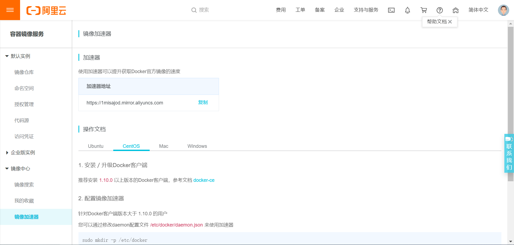

# Docker安装

<!-- TOC -->

- [Docker安装](#Docker%E5%AE%89%E8%A3%85)
  - [一、安装Docker](#%E4%B8%80%E5%AE%89%E8%A3%85Docker)
    - [1.1创建仓库](#11%E5%88%9B%E5%BB%BA%E4%BB%93%E5%BA%93)
    - [1.3开启Docker](#13%E5%BC%80%E5%90%AFDocker)
    - [1.4镜像加速设置](#14%E9%95%9C%E5%83%8F%E5%8A%A0%E9%80%9F%E8%AE%BE%E7%BD%AE)
  - [二、Docker安装redis](#%E4%BA%8CDocker%E5%AE%89%E8%A3%85redis)
    - [2.2使用redis镜像](#22%E4%BD%BF%E7%94%A8redis%E9%95%9C%E5%83%8F)
  - [三、Docker安装Mysql](#%E4%B8%89Docker%E5%AE%89%E8%A3%85Mysql)
  - [五、Docker安装Oracler 12c](#%E4%BA%94Docker%E5%AE%89%E8%A3%85Oracler-12c)

<!-- /TOC -->
## 一、安装Docker

### 1.1创建仓库

[官方文档](https://docs.docker.com/install/linux/docker-ce/centos/)

```shell
sudo yum install -y yum-utils \
  device-mapper-persistent-data \
  lvm2
  
sudo yum-config-manager \
    --add-repo \
    https://download.docker.com/linux/centos/docker-ce.repo  
```

###1.2安装Docker CE

```shell
sudo yum install docker-ce docker-ce-cli containerd.io
```

### 1.3开启Docker

```shell
sudo systemctl start docker
```

### 1.4镜像加速设置
1. 登录阿里云网址  https://cr.console.aliyun.com
2. 点击镜像加速，即可看到属于自己的专属加速链接（如下图）
   

## 二、Docker安装redis

###2.1安装redis

```shell
docker pull redis
```

### 2.2使用redis镜像

```shell
docker run -p 6379:6379 -v $PWD/data:/data  -d redis:3.2 redis-server --appendonly yes
```

**命令说明**

>**-p 6379:6379 :** 将容器的6379端口映射到主机的6379端口
>
>**-v $PWD/data:/data :** 将主机中当前目录下的data挂载到容器的/data
>
>**redis-server --appendonly yes :** 在容器执行redis-server启动命令，并打开redis持久化配置

## 三、Docker安装Mysql

```shell
docker pull mysql
```

```shell
docker run -p 3306:3306 --name mymysql -v $PWD/conf:/etc/mysql/conf.d -v $PWD/logs:/logs -v $PWD/data:/var/lib/mysql -e MYSQL_ROOT_PASSWORD=root -d mysql
```

**命令说明**

> - **-p 3306:3306**：将容器的 3307 端口映射到主机的 3306 端口。
> - **-v -v $PWD/conf:/etc/mysql/conf.d**：将主机当前目录下的 conf/my.cnf 挂载到容器的 /etc/mysql/my.cnf。
> - **-v $PWD/logs:/logs**：将主机当前目录下的 logs 目录挂载到容器的 /logs。
> - **-v $PWD/data:/var/lib/mysql** ：将主机当前目录下的data目录挂载到容器的 /var/lib/mysql 。
> - **-e MYSQL_ROOT_PASSWORD=root：**初始化 root 用户的密码。

**进入容器**

```shell
#进入容器
docker exec -it mymysql bash

#登录mysql
mysql -u root -p
ALTER USER 'root'@'localhost' IDENTIFIED BY 'root';
#把mysql 8.0的认证方式改回去就能用Navicat访问了
ALTER USER 'root'@'%' IDENTIFIED WITH mysql_native_password BY 'root';

#添加远程登录用户
GRANT ALL PRIVILEGES ON *.* TO 'root'@'%';

# 再次运行，首先通过docker ps -a 找到对应的ID
docker start CONTAINERID
```

**退出镜像**

```shell
docker container stop CONTAINERID
```

## 五、Docker安装Oracler 12c

```shell
docker pull absolutapps/oracle-12c-ee

docker run -d --name oracle \
  --privileged -v $(pwd)/oradata:/u01/app/oracle \
  -p 8082:8080 -p 1521:1521 absolutapps/oracle-12c-ee 

# 3983c5fa25e2 是 containerID
docker exec -it  3983c5fa25e2  /bin/bash

# 默认用户名: SYSTEM 密码:oracle
```

