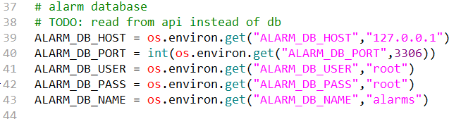
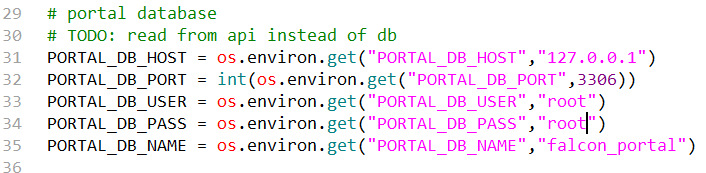

# Open-Falcon
## 一、安装Open-Falcon


[后端github](https://github.com/open-falcon/falcon-plus)

[前端github](https://github.com/open-falcon/dashboard)

```shell
# 安装gcc
yum -y install gcc gcc-c++ kernel-devel

mkdir -p $GOPATH/src/github.com/open-falcon
cd $GOPATH/src/github.com/open-falcon
git clone https://github.com/open-falcon/falcon-plus.git

# 初始化数据库
cd $GOPATH/src/github.com/open-falcon/falcon-plus/scripts/mysql/db_schema/
mysql -h 192.168.0.129 -P 3307 -u root -p < 1_uic-db-schema.sql
mysql -h 192.168.0.129 -P 3307  -u root -p < 2_portal-db-schema.sql
mysql -h 192.168.0.129 -P 3307  -u root -p < 3_dashboard-db-schema.sql
mysql -h 192.168.0.129 -P 3307  -u root -p < 4_graph-db-schema.sql
mysql -h 192.168.0.129 -P 3307  -u root -p < 5_alarms-db-schema.sql
```
[模块配置教程](https://www.cnblogs.com/straycats/p/7199209.html)

前端/home/work/open-falcon/dashboard/rrd/config.py中修改


admin haitao

```shell
# 开启前端 /home/work/open-falcon/dashboard
./env/bin/python wsgi.py
```
## 二、agent模块
